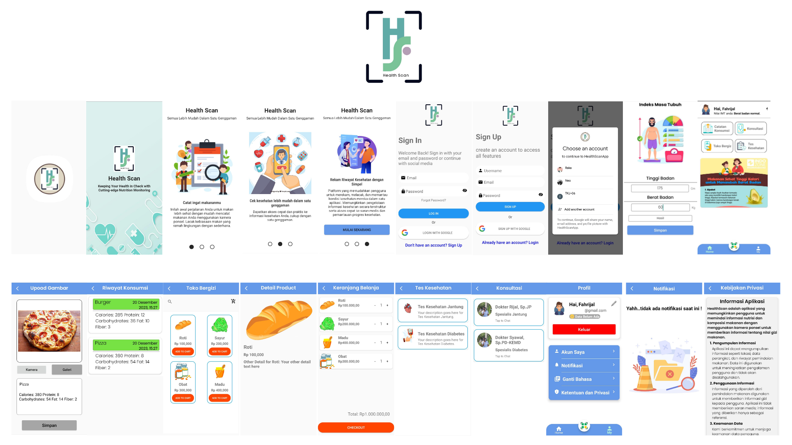

# HealthScan:
## Keeping Your Health in Check with Cutting-edge Nutrition Monitoring

  

This capstone project was created in response to the increasingly troubling health issues resulting from the consumption of unhealthy processed foods. In an age where convenience often takes precedence over nutritional value, the proliferation of preservatives and harmful substances in food, especially junk food, has caused detrimental impacts on public health. This includes the accumulation of fat and calories, which significantly contributes to the onset of obesity and various related diseases.
#

  

#

# Features of HealthScan:

### Welcome Screen
- **Splash Screen**: A visually appealing splash screen to welcome users and provide a smooth onboarding experience.

### User Authentication
- **Sign In**: Secure authentication for registered users to access the app.
- **Sign Up**: User-friendly registration process for new users to create an account.
- **Sign In with Google**: Convenient option for users to sign in using their Google accounts.

### Health Monitoring
- **Body Mass Index (BMI) Page**: An informative page to calculate and monitor the user's Body Mass Index.

### Home
- **Home Page**: Central hub for users to navigate and access various features of the HealthScan app.

### Food Scan and Image Upload
- **Scan and Upload**: Functionality to scan food items and upload images for nutritional analysis.

#### Consumption History
- **Consumption History**: Keep track of scanned food items with a comprehensive consumption history.

### Nutrient Store
- **Nutrient Store Page**: Explore a variety of nutritious products available for purchase.

### Product Details
- **Product Details Page**: Detailed information about specific products in the Nutrient Store.

### Shopping Cart
- **Shopping Cart Page**: Conveniently manage and review selected items before making a purchase.

### Health Tests
- **Health Tests Page**: Access health assessments and tests to monitor overall well-being.

### Consultation
- **Consultation Page**: Seek professional advice and consultations for health-related queries.

### User Profile
- **Profile Page**: Personalized user profiles with customizable settings and preferences.

### Notifications
- **Notification Page**: Stay informed with notifications about app updates and health-related alerts.

### Privacy Policy
- **Privacy Policy Page**: Clearly defined privacy policy to ensure user data protection and transparency.

# Video Introduce App 

# Installation
Apk file for app installation can be found on our latest release [here](https://bit.ly/HealthScanApp),Please beware that this app require permission to open gallery and also require Android version Lollipop 5.0 or above.

# Video Demo App

# Project Documents:
- [Project Brief](https://docs.google.com/document/d/1ccTI_XTJYurFqLjXduRLQWdjIyV56cinfTyRKx5fURQ/edit#heading=h.qf0nfa3etlmx)
- [Final Presentation](https://www.canva.com/design/DAF2x2oiILg/YLlfhOWR0VDerYGHQ_3wRg/edit?utm_content=DAF2x2oiILg&utm_campaign=designshare&utm_medium=link2&utm_source=sharebutton)

# Capstone Project Team:
- **(MD) A525BSY2453**: Mohamad Aji Hermansya
- **(MD) A012BSY2739**: Fahrijal Syawaludin
- **(ML) M198BSY0401**: Muammar Khadafi 
- **(ML) M245BSY1119**: Adji Maulana Asror
- **(ML) M247BSX0606**: Najwa Dwi Febrianti
- **(CC) C525BSX3872**: Wahyu Rizqi Amalia
- **(CC) C161BSY3571**: Riki Awaludin  